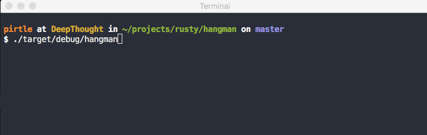

# Hangman

a hangman cli game! you can play hangman with ascii drawings!

## about the HangmanCanvas

is it overkill? probably. would it have been easier to just make ascii slides that get printed? definitely! but was it a fun learning experience to design and write? you bet!

### how it works

the canvas divides a game of hangman into 7 steps (0 to 6). the step number represents the number of missed guesses. the method you should know exists:

`canvas.print_step(n: usize)`: prints the ascii drawing for the `n`th step of the game

### under the hood

there are two ascii files that make the magic happen. [one](src/hangman.ascii) is the completed drawing of a lost game. [the other](src/hangman_mask.ascii) is a mask of which corresponding characters of the completed ascii break into which reveal steps. with this setup, the actual ascii image gets revealed can be customized with ascii drawing of even higher calibers than the one i made in 5 minutes. of course, if i add in customizability, it'll need to handle more than just a canvas of 14x8 letters :man_shrugging:

# license

© 2020, [Robert Pirtle](https://robert.pirtle.xyz/). licensed under [MIT](https://choosealicense.com/licenses/mit/).
